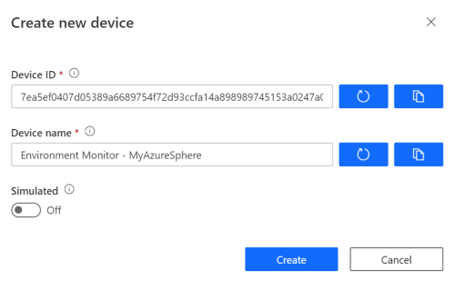
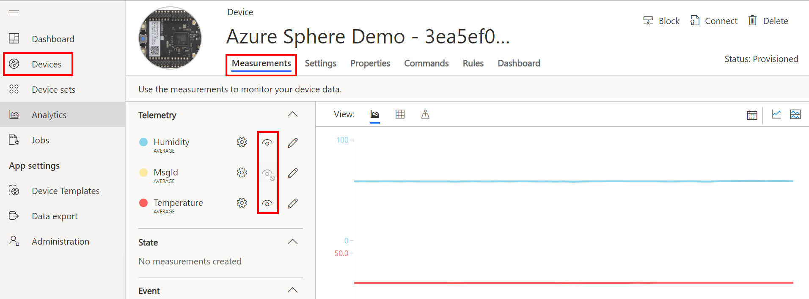
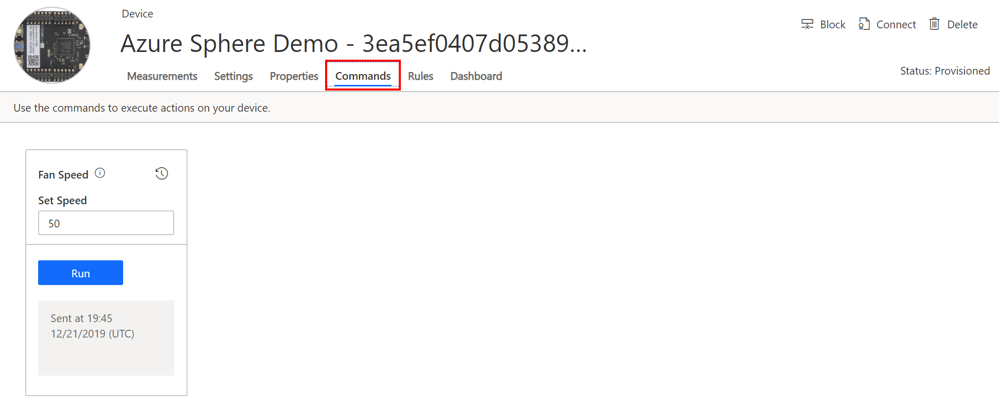
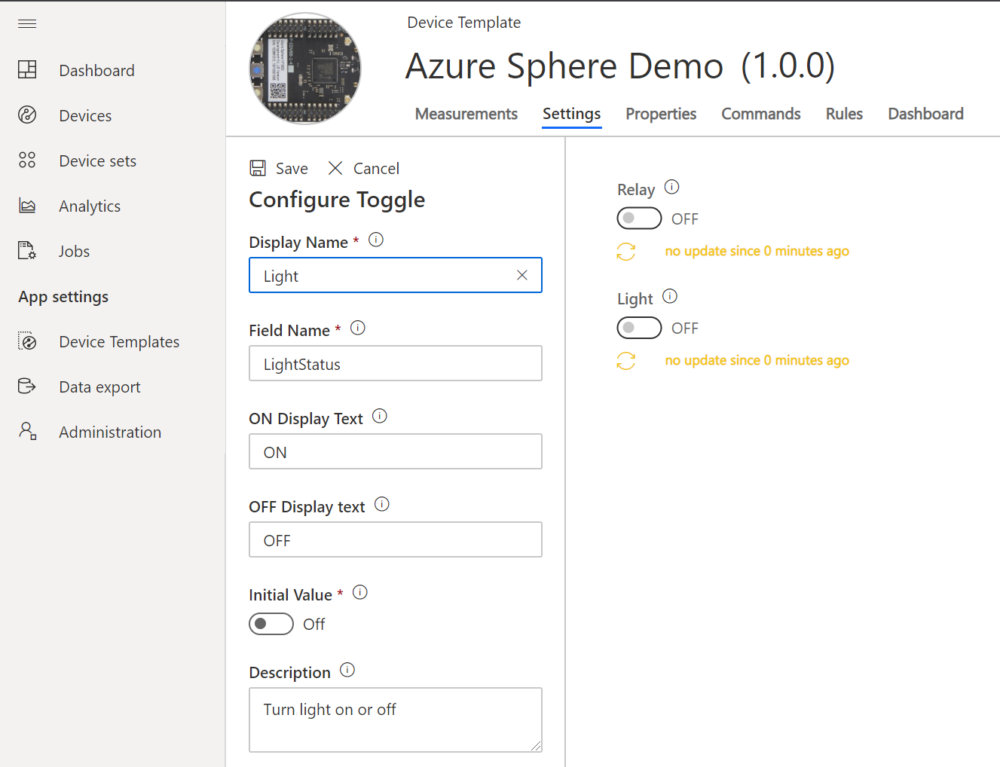

# Azure Sphere: A Solution Building Secure IoT Devices

<!--  -->

Follow me on Twitter [@dglover](https://twitter.com/dglover)

|Author|[Dave Glover](https://developer.microsoft.com/en-us/advocates/dave-glover?WT.mc_id=github-blog-dglover), Microsoft Cloud Developer Advocate |
|:----|:---|
|Target Platform | Seeed Studio Azure Sphere MT3620 |
|Target Service | [Azure IoT Central](https://azure.microsoft.com/services/iot-central/?WT.mc_id=github-blog-dglover) |
|Developer Platform | Windows 10 or Ubuntu 18.04 |
|Azure SDK | Azure Sphere SDK 19.11 or better |
|Developer Tools| [Visual Studio (The free Community Edition or better)](https://visualstudio.microsoft.com/vs/?WT.mc_id=github-blog-dglover) or [Visual Studio Code (Free OSS)](https://code.visualstudio.com?WT.mc_id=github-blog-dglover)|
|Hardware | [Seeed Studio Grove Shield](https://www.seeedstudio.com/MT3620-Grove-Shield.html), and the [Grove Temperature and Humidity Sensor (SHT31)](https://www.seeedstudio.com/Grove-Temperature-Humidity-Sensor-SHT31.html) |
|Source Code | https://github.com/gloveboxes/Create-a-Secure-IoT-Solution-with-Azphere-Sphere-and-and-Azure-IoT-Central|
|Language| C|
|Date|As of January, 2020|


## What you will learn

1. How to run a **FreeRTOS** Real Time application on Azure Sphere and integrate with Azure IoT.
2. How to create an Azure IoT Central Application.
2. How to integrating an [Azure Sphere](https://azure.microsoft.com/services/azure-sphere/?WT.mc_id=github-blog-dglover) application with [Azure IoT Central](https://azure.microsoft.com/services/iot-central/?WT.mc_id=github-blog-dglover).
3. How to securely control an Azure Sphere remotely from Azure IoT Central **[Settings](https://docs.microsoft.com/en-us/azure/iot-hub/iot-hub-devguide-device-twins?WT.mc_id=github-blog-dglover)** and **[Commands](https://docs.microsoft.com/en-us/azure/iot-hub/iot-hub-devguide-direct-methods?WT.mc_id=github-blog-dglover)**.


If unfamiliar with Azure Sphere development then review the [Create a Secure Azure Sphere App using the Grove Shield Sensor Kit](https://github.com/gloveboxes/Create-a-Secure-Azure-Sphere-App-using-the-Grove-Shield-Sensor-Kit) tutorial before starting this tutorial.

## Azure Sphere Solution Architecture

There are **two** applications deployed to the Azure Sphere. 


1. The first application is a **High Level** *Linux* application running on the **Cortex A7** core. It is responsible for sending temperature and humidity data to Azure IoT Central, processing Digital Twin and Direct Method messages from Azure IoT Central, and finally, passing on **inter-core** messages from the *FreeRTOS* application running on the Real Time core to Azure IoT Central.
1. The second is a **Real Time** *FreeRTOS* application running in the **Cortex M4**. It runs a number of FreeRTOS Tasks. The first task is to blink an LED, the second is to monitor for button presses, and the third is to send **inter-core** messages to the **High Level** application whenever the button is pressed. **Note**, the FreeRTOS application running on the Real Time core cannot connect directly to the network.


## What is Azure Sphere

Azure Sphere is a secured, high-level application platform with built-in communication and security features for internet-connected devices.


It comprises a secured, connected, crossover microcontroller unit (MCU), a custom high-level Linux-based operating system (OS), and a cloud-based security service that provides continuous, renewable security.


## Azure Sphere and Azure IoT

Your Azure Sphere devices can communicate with the Azure IoT with Azure IoT Hub or Azure IoT Central. This tutorial focuses on Azure IoT Central.

This project also uses the Azure Device Provisioning Service (DPS) included with Azure IoT Central. If you are using Azure IoT Hub then you need to create an instance of [Azure Device Provisioning Service](https://docs.microsoft.com/en-us/azure-sphere/app-development/use-azure-iot).

### What is Azure IoT Central

[Azure IoT Central](https://azure.microsoft.com/en-in/services/iot-central/?WT.mc_id=github-blog-dglover) provides an easy way to connect, monitor and manage your Internet of Things (IoT) assets at scale.


## Tutorial Overview

1. Create an Azure IoT Central Application (Free trial)
2. Set up Azure IoT Central to work with Azure Sphere
3. Deploy an Azure IoT Central application to Azure Sphere

## Developer Environment

Follow the [Install for Windows](https://docs.microsoft.com/en-gb/azure-sphere/install/overview) guide, install the Azure Sphere SDK for Visual Studio, claim your device, and configure the Azure Sphere network.

## Clone the following GitHub Repositories

1. The Azure Sphere Samples

    ```bash
    git clone https://github.com/Azure/azure-sphere-samples.git
    ```

2. This tutorial

    ```bash
    git clone https://github.com/gloveboxes/Azure-Sphere-IoT-Central-HL-and-RT-Core-Integation.git
    ```

## Deploy the FreeRTOS Application to Azure Sphere

1. Start Visual Studio 2019, select **Open a local folder**, navigate to the Azure Sphere tutorial project folder, then open the  **azure-sphere-rtcore-freertos** project.
2. Set the startup configuration. Select the **ARM-Debug** configuration, and the **GDB Debugger (RTCore)** startup item.

    
3. Press <kbd>**F5**</kbd>, this will start the build, deploy, attach debugger process. The leftmost **blue LED** will start **blinking**. 
5. Press **Button A** on the Azure Sphere to change the blink rate. 
6. You can **Remote Debug** the FreeRTOS application running on Azure Sphere Cortex M4 Core. 
    1. From Visual Studio, open the FreeRTOS application **main.c** file.
    2. Set a [Visual Studio Breakpoint](https://docs.microsoft.com/en-us/visualstudio/debugger/using-breakpoints?view=vs-2019) in the **ButtonTask** function on the line that reads ```bool pressed = !newState;```.
    3. Press **Button A** on the Azure Sphere, Visual Studio will halt the execution of the FreeRTOS application and you can step through the code. Pretty darn neat!

### Understanding the Real Time Core Security

Applications on the the Azure Sphere are locked down by default. You need to grant capabilities to the application.

From Visual Studio open the **app_manifest.json** file.

**Observe**:

1. GPIO Capabilities: This application uses two GPIO pins. Pins 10, and 12.
2. Allowed Application Connections: This is the ID of the High Level application that this application will be partnered with. It is required for inter core communications.

```json
{
  "SchemaVersion": 1,
  "Name": "GPIO_RTApp_MT3620_BareMetal",
  "ComponentId": "6583cf17-d321-4d72-8283-0b7c5b56442b",
  "EntryPoint": "/bin/app",
  "CmdArgs": [],
  "Capabilities": {
    "Gpio": [ 10, 12 ],
    "AllowedApplicationConnections": [ "25025d2c-66da-4448-bae1-ac26fcdd3627" ]
  },
  "ApplicationType": "RealTimeCapable"
}

```

### Declaring the Partner Application

In the **launch.js.json** file you need to declare the ID of the High Level Application that this Real Time application will be communicating with.

```json
{
    ...
    "configurations": [
        ...
        "partnerComponents": [ "25025d2c-66da-4448-bae1-ac26fcdd3627" ]
    ]
}
```

## Getting Started with Azure IoT Central

We are going to create an Azure IoT Central application, connect Azure IoT Central to an Azure Sphere Tenant, and finally create a device.

---

### Step 1: Create an Azure IoT Central Application

Follow instructions to **[Create an Azure Iot Central Application](resources/azure-iot-central/azure-iot-central.md)**

---

### Step 2: Connect Azure IoT Central to an Azure Sphere Tenant

Any device that is claimed by your Azure Sphere tenant will be automatically enrolled when it first connects to your Azure IoT Central application.

Follow instructions to **[Set up Azure IoT Central to work with Azure Sphere](https://docs.microsoft.com/en-au/azure-sphere/app-development/setup-iot-central)**.

---

### Step 3: Create an Azure Device in Azure IoT Central

From the **Azure Sphere Developer Command Prompt**, type the following command.

```bash
azsphere device show-attached
```

Note: The Create New Device dialog box in Azure IoT Central requires that the device ID be in lowercase characters. From the Azure Sphere Developer Command Prompt, enter the following command, which gets the ID of the attached device and converts it to lowercase:

```bash
powershell -Command ((azsphere device show-attached)[0] -split ': ')[1].ToLower()
```

#### Switch back to Azure IoT Central Web Portal

1. Select Devices from the side menu, then the Device Template previously created.


2. Click **+ New** to add a new device

    Paste in the **device ID** you generated with the PowerShell command into the **Device ID** field and give your device a friendly name.



3. Click **Create** to create the new device.

## Configure the Azure Sphere Application for Azure IoT Central

Review the [Azure IoT Central Sample ](https://github.com/Azure/azure-sphere-samples/blob/master/Samples/AzureIoT/IoTCentral.md) guide.

### Config the Azure Sphere Application

1. Open the **azure-sphere-hlcore-iot-central** solution you cloned with Visual Studio
2. Open the **app_manifest.json** file
3. Set the **default Azure Sphere Tenant**

    You may need to select the default Azure Sphere Tenant. Use the ```azsphere tenant list``` command to list available tenants, use the ```azsphere tenant select -i <guid>``` to select the default tenant.
4. Get the **Tenant ID**. 
    
    From the **Azure Sphere Developer Command Prompt**, issue the following command. 

    ```bash
    azsphere tenant show-selected
    ```

    Copy the returned value and paste it into the **DeviceAuthentication** field of the **app_manifest.json** file:

5. Get the **Device Provisioning Service Url**

    From the **Azure Sphere Developer Command Prompt**, change to the *azure-sphere-samples\Samples\AzureIoT\Tools* folder you previously cloned, and run *ShowIoTCentralConfig.exe*.

    ```bash
    ShowIoTCentralConfig
    ```

    When prompted, log in with the credentials you use for Azure IoT Central.

    The output of this command will be similar as follows:

    ```
    Are you using a Work/School account to sign in to your IoT Central Application (Y/N) ?

    Getting your IoT Central applications
    You have one IoT Central application 'yourappname-iot-central'.
    Getting the Device Provisioning Service (DPS) information.
    Getting a list of IoT Central devices.

    Find and modify the following lines in your app_manifest.json:
    "CmdArgs": [ "0ne9992KK6D" ],
    "AllowedConnections": [ "global.azure-devices-provisioning.net", "saas-iothub-9999999-f33a-4002-4444-7ca8989898989.azure-devices.net" ],
    "DeviceAuthentication": "--- YOUR AZURE SPHERE TENANT ID--- ",
    ```
7. 	Set the **AllowedConnections** Information

    Copy the **AllowedConnections** URLs into the **app_manifest.json**. The app_manifest.json file should look similar to the following:

    ```json
    {
    "SchemaVersion": 1,
    "Name": "AzureSphereBlink1",
    "ComponentId": "a3ca0929-5f46-42b0-91ba-d5de1222da86",
    "EntryPoint": "/bin/app",
    "CmdArgs": [ "0ne9992KK6D" ],
    "Capabilities": {
        "Gpio": [ 9 ],
        "Uart": [ "ISU0" ],
        "AllowedConnections": [ "global.azure-devices-provisioning.net", "saas-iothub-9999999-f33a-4002-4444-7ca8989898989.azure-devices.net" ],
        "DeviceAuthentication": "999x999xeb-e021-43ce-8gh8-8k9lp888494"
    },
    "ApplicationType": "Default"
    }
    ```

### Configure Visual Studio App Deployment Settings

Before building the application with Visual Studio ensure ARM-Debug and GDB Debugger (HLCore) options are selected.


### Build, Deploy, and start Debugging

To start the build, deploy, debug process either click the Visual Studio **Start Selected Item** icon or press <kbd>**F5**</kbd>. To Build and deploy without attaching the debugger, simply press <kbd>**Ctrl+F5**</kbd>.


## Azure IoT Central Integration

Now the application is running on the Azure Sphere switch across to Azure IoT Central, select the **Devices** tab, the device template you created, then the actual device. You may have to wait a moment before the telemetry is displayed in the **Measurements** panel.



### Azure IoT Central Settings

To work with settings you will need to update the Device Template and add settings for **Light** and **Relay**. See the Appendix.

Switch to the settings tab on Azure IoT Central and change the toggle state and click update and observe an LED on the Azure Sphere will toggle between on and off.


## Finished 完了 fertig finito ख़त्म होना terminado

Congratulations you have finished the tutorial.


## Appendix

### Learn about Azure Sphere

1. [Azure Sphere Documentation](https://docs.microsoft.com/en-au/azure-sphere/)
1. Using Yocto to Build an IoT OS Targeting a Crossover SoC. [Video](https://www.youtube.com/watch?v=-T7Et5qfqQQ), and [Slides](https://static.sched.com/hosted_files/ossna19/91/Crossover_ELC2019.pdf)
2. [Anatomy of a secured MCU](https://azure.microsoft.com/en-au/blog/anatomy-of-a-secured-mcu/)
3. [Azure Sphere’s customized Linux-based OS](https://azure.microsoft.com/en-au/blog/azure-sphere-s-customized-linux-based-os/)
4. [Tech Communities Blog](https://techcommunity.microsoft.com/t5/internet-of-things/bg-p/IoTBlog)


#### InitPeripheralsAndHandlers

Sets up SIGTERM termination handler, initialize peripherals, and set up event handlers.

```c
static int InitPeripheralsAndHandlers(void)
{
    struct sigaction action;
    memset(&action, 0, sizeof(struct sigaction));
    action.sa_handler = TerminationHandler;
    sigaction(SIGTERM, &action, NULL);

    epollFd = CreateEpollFd();
    if (epollFd < 0) {
        return -1;
    }

    OpenPeripheral(&sending);
    OpenPeripheral(&relay);
    OpenPeripheral(&light);

    // Initialize Grove Shield and Grove Temperature and Humidity Sensor
    GroveShield_Initialize(&i2cFd, 115200);
    sht31 = GroveTempHumiSHT31_Open(i2cFd);

    StartTimer(&iotClientDoWork);
    StartTimer(&iotClientMeasureSensor);

    return 0;
}
```

#### GetTelemetry

Reads sensor telemetry and returns the data as a JSON object.

```c
static int ReadTelemetry(char eventBuffer[], size_t len) {
    GroveTempHumiSHT31_Read(sht31);
    float temperature = GroveTempHumiSHT31_GetTemperature(sht31);
    float humidity = GroveTempHumiSHT31_GetHumidity(sht31);

    static const char* EventMsgTemplate = "{ \"Temperature\": \"%3.2f\", \"Humidity\": \"%3.1f\", \"MsgId\":%d }";
    return snprintf(eventBuffer, len, EventMsgTemplate, temperature, humidity, msgId++);
}
```

#### TwinCallback

Handles [Azure IoT Hub Device Twins](https://docs.microsoft.com/en-us/azure/iot-hub/iot-hub-devguide-device-twins?WT.mc_id=github-blog-dglover).

In Azure IoT Central, Azure IoT Hub Device Twins are exposed in the user interface as *Settings*.


```c
static void TwinCallback(DEVICE_TWIN_UPDATE_STATE updateState, const unsigned char* payload,
    size_t payloadSize, void* userContextCallback)
{
    JSON_Value* root_value = NULL;
    JSON_Object* root_object = NULL;

    char* payLoadString = (char*)malloc(payloadSize + 1);
    if (payLoadString == NULL) {
        goto cleanup;
    }

    memcpy(payLoadString, payload, payloadSize);
    payLoadString[payloadSize] = 0; //null terminate string

    root_value = json_parse_string(payLoadString);
    if (root_value == NULL) {
        goto cleanup;
    }

    root_object = json_value_get_object(root_value);
    if (root_object == NULL) {
        goto cleanup;
    }


    JSON_Object* desiredProperties = json_object_dotget_object(root_object, "desired");
    if (desiredProperties == NULL) {
        desiredProperties = root_object;
    }

    SetDesiredState(desiredProperties, &relay);
    SetDesiredState(desiredProperties, &light);

cleanup:
    // Release the allocated memory.
    if (root_value != NULL) {
        json_value_free(root_value);
    }
    free(payLoadString);
}
```

#### AzureDirectMethodHandler

Handles [Azure IoT Hub Direct Methods](https://docs.microsoft.com/en-us/azure/iot-hub/iot-hub-devguide-direct-methods?WT.mc_id=github-blog-dglover)

In Azure IoT Central, Azure IoT Hub Direct Methods are exposed in the user interface as *Commands*.



```c
static int AzureDirectMethodHandler(const char* method_name, const unsigned char* payload, size_t payloadSize,
    unsigned char** responsePayload, size_t* responsePayloadSize, void* userContextCallback) {

    const char* onSuccess = "\"Successfully invoke device method\"";
    const char* notFound = "\"No method found\"";

    const char* responseMessage = onSuccess;
    int result = 200;
    JSON_Value* root_value = NULL;
    JSON_Object* root_object = NULL;

    // Prepare the payload for the response. This is a heap allocated null terminated string.
    // The Azure IoT Hub SDK is responsible of freeing it.
    *responsePayload = NULL;  // Response payload content.
    *responsePayloadSize = 0; // Response payload content size.

    char* payLoadString = (char*)malloc(payloadSize + 1);
    if (payLoadString == NULL) {
        responseMessage = "payload memory failed";
        result = 500;
        goto cleanup;
    }

    memcpy(payLoadString, payload, payloadSize);
    payLoadString[payloadSize] = 0; //null terminate string

    root_value = json_parse_string(payLoadString);
    if (root_value == NULL) {
        responseMessage = "Invalid JSON";
        result = 500;
        goto cleanup;
    }

    root_object = json_value_get_object(root_value);
    if (root_object == NULL) {
        responseMessage = "Invalid JSON";
        result = 500;
        goto cleanup;
    }

    if (strcmp(method_name, "fanspeed") == 0)
    {
        int speed = (int)json_object_get_number(root_object, "speed");
        Log_Debug("Set fan speed %d", speed);
    }
    else
    {
        responseMessage = notFound;
        result = 404;
    }

cleanup:

    // Prepare the payload for the response. This is a heap allocated null terminated string.
    // The Azure IoT Hub SDK is responsible of freeing it.
    *responsePayloadSize = strlen(responseMessage);
    *responsePayload = (unsigned char*)malloc(*responsePayloadSize);
    strncpy((char*)(*responsePayload), responseMessage, *responsePayloadSize);

    if (root_value != NULL) {
        json_value_free(root_value);
    }
    free(payLoadString);

    return result;
}
```

### Azure IoT Central Template Settings for Device Twins


