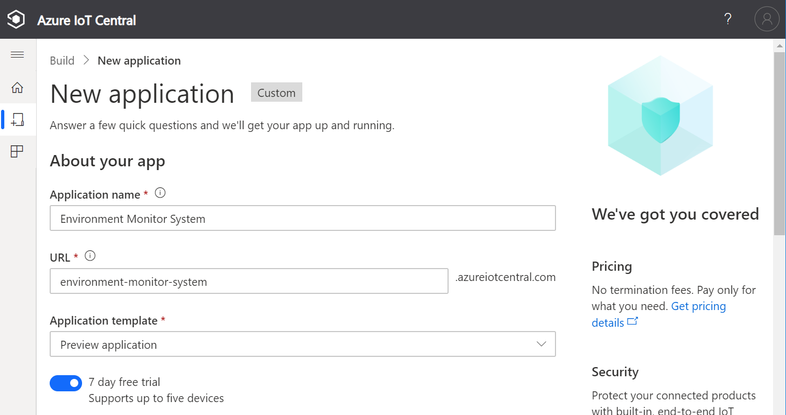
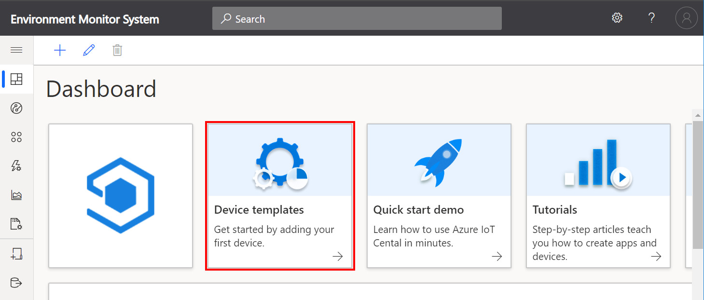
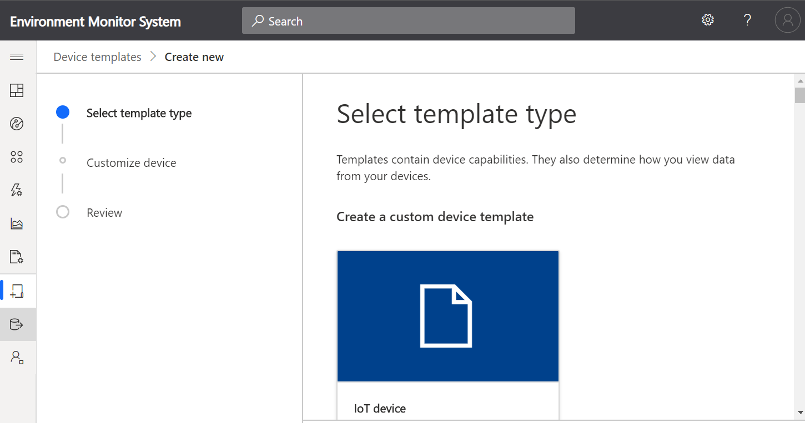
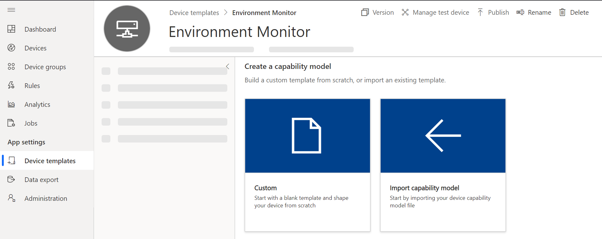
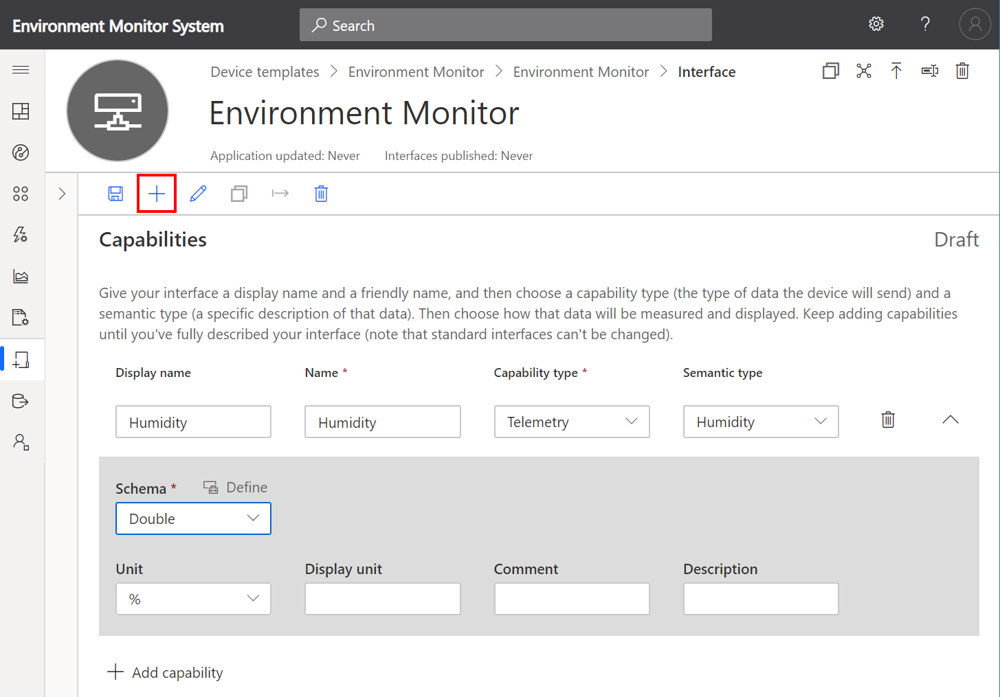
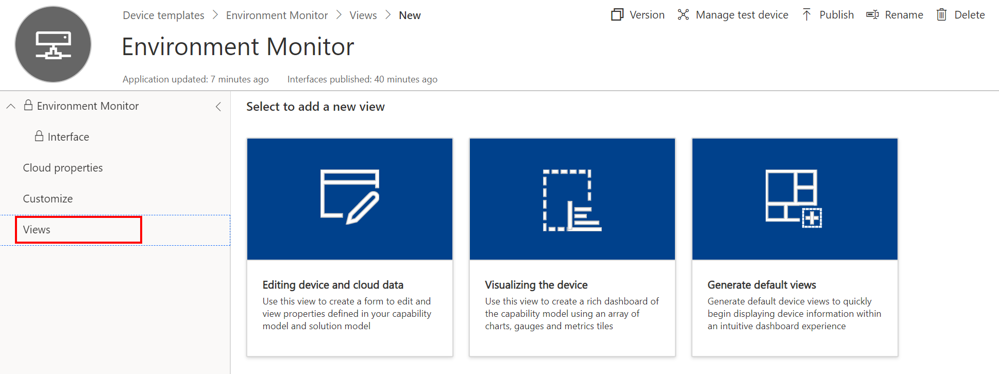

## Create an Azure IoT Central Application

We are going to create an Azure IoT Central application, connect Azure IoT Central to an Azure Sphere Tenant, and finally create a device.

1. Open the [Azure IoT Central](https://azure.microsoft.com/en-au/services/iot-central/?WT.mc_id=github-blog-dglover) in a new browser tab, then click **Getting started**.

2. Next, you will need to sign with your **Microsoft** Personal, or Work, or School account. If you do not have a Microsoft account, then you can create one for free using the **Create one!** link.

    

3. Create a new Azure IoT Central application. Scroll to the bottom of the screen, select **Create a custom app**. This takes you to the **Create Application** page.

### Create a **New application**

Specify **Application name**, **URL**, enable **7 day free trial**, and complete the registration form. Then click **Create**.

1. Add new Device Template

    Click **Device templates**

    

2. Select **IoT device** template type

    

3. Create an **IoT Device** Template

    1. Select **IoT device**,
    2. Click **Next:Customise**,
    3. Click **Next: Review**,
    4. Click **Create**.
    5. Name your template, and press **Enter**

### Create a Capability Model

A Capability Model describes how Azure IoT Central interacts with a device, and how telemetry should be displayed in IoT Central.

#### Add an Interface

1. Click **Custom**,

2. Click the **+ Add interface** to add an **Interface**.

3. Choose **Custom** interface.
<!--  -->

#### Add Capabilities

Click **<** (Collapse) to create more working space.

1. Add **Humidity** Capability
    1. Click **+** to Add capability.
    2. Add **Humidity** Telemetry Capability
    3. Set the Unit to **%**

    

2. Click **Add Capability** and add **Temperature** Capabilities

    * Display name: Temperature
    * Name: Temperature
    * Semantic type: Temperature
    * Units: C
    * Display Unit: C

3. Click **Save** to save the capabilities model.

    

#### Create a Device Template View

1. Click **Views**
2. Click **Generate default views**
3. Click **Generate default dashboard view(s)**
4. You can customize the default view later.

    

#### Publish the Template

Click **Publish** to activate the template, then click **Publish**.

## Azure Sphere Device Control and Events

Now that we have created the Azure IoT Central application we are going to add support for controlling the Azure Sphere device from Azure IoT Central, along with adding *event* support.

There are two ways to control or set state on the Azure Sphere device from IoT Central.

1. The first is Azure IoT Central Device **Settings**. Under the covers these are implemented as [Azure IoT Device Twins](https://docs.microsoft.com/en-us/azure/iot-hub/iot-hub-devguide-device-twins). A message is sent the device, the corresponding action is undertaken, and then the Azure Sphere updates the Azure IoT Device Twin. The Device Twin is a JSON document that mirrors the state of the device. The JSON document can be used for cloud side queries and processing.

2. The second way to control a device is Azure IoT Central **Commands**. Under the covers these are implemented as [Azure IoT Direct Methods](https://docs.microsoft.com/en-us/azure/iot-hub/iot-hub-devguide-direct-methods). A message is sent to the device, the action carried out, and then the device acknowledges to Azure IoT the command has completed.

